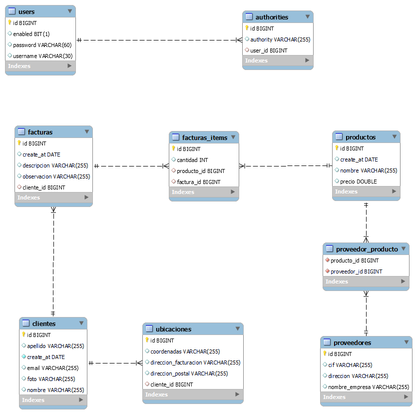
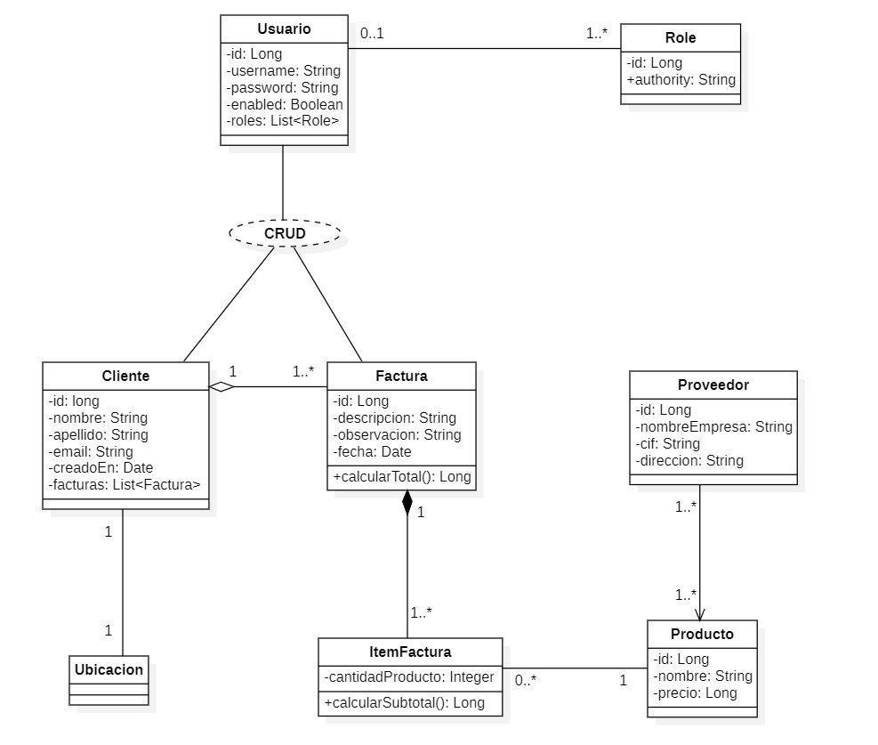
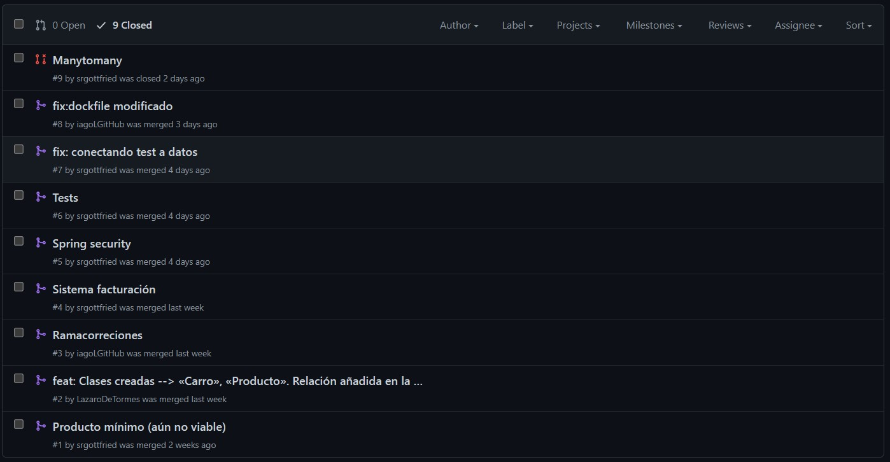
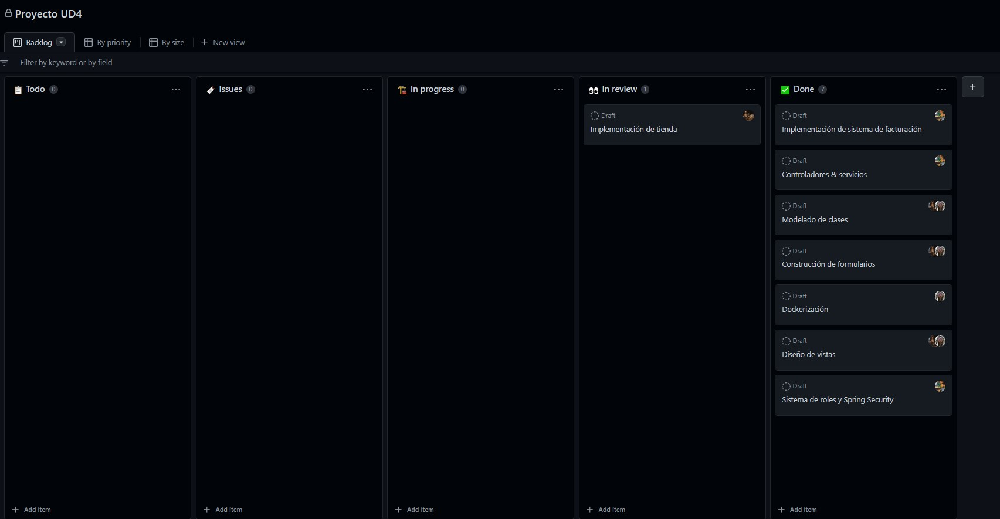
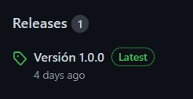

# Índice

<!-- TOC -->
* [Participantes](#participantes)
* [Supuesto textual](#supuesto-textual)
* [Manual técnico](#manual-técnico)
  * [Modelado](#modelado)
    * [Diagrama de BD](#diagrama-de-bd)
    * [Diagrama de clases](#diagrama-de-clases)
    * [Modelado de relaciones](#modelado-de-relaciones)
      * [Relaciones `OneToOne`](#relaciones-onetoone)
      * [Relaciones `OneToMany` y `ManyToOne`](#relaciones-onetomany-y-manytoone)
      * [Relaciones `ManyToMany`](#relaciones-manytomany)
    * [Modelado de operativa CRUD](#modelado-de-operativa-crud)
      * [Modelado en DAO](#modelado-en-dao)
      * [Modelado en WEB](#modelado-en-web)
    * [Estructura de directorios](#estructura-de-directorios)
    * [Javadoc](#javadoc)
  * [Conexiones](#conexiones)
    * [Localhost](#localhost)
      * [Direccion del servicio es:](#direccion-del-servicio-es-)
      * [Credenciales de acceso:](#credenciales-de-acceso-)
    * [Azure](#azure)
      * [Direccion del servicio es:](#direccion-del-servicio-es--1)
      * [Credenciales de acceso:](#credenciales-de-acceso--1)
  * [Dockerización](#dockerización)
* [Manual de usuario](#manual-de-usuario)
* [GitHub](#github)
    * [Pull request](#pull-request)
    * [GitHub Proyect](#github-proyect)
    * [GitHub Release](#github-release)
    * [Commit conventions](#commit-conventions)
* [Extras](#extras)
* [Propuestas de mejora](#propuestas-de-mejora)
* [Conclusión](#conclusión)
<!-- TOC -->

---

# Participantes

- Manuel Landín Gómez
- Iago Leirós Pérez
- Alejandro Vázquez González

# Supuesto textual

Se quiere construir una aplicación web que facilite el proceso de gestión de facturas para clientes
de una empresa genérica. La implantación del sistema se puede hacer para empresas de diferentes sectores,
definiendo el modelo de negocio en base a dos componentes:

- El uso de la aplicación web.
- La implantación y mantenimiento del servicio.

El sistema de facturación permitirá a usuarios de carácter operador manejar un conjunto de usuarios cliente.
La aplicación contará con dos roles de usuario operador, uno de perfil medio con permisos de
lectura y uno de perfil alto con permisos de lectura y escritura.
Los clientes serán potenciales consumidores de bienes o servicios proveeídos por la empresa. Estos
productos serán computados en facturas asociadas al perfil de cada cliente. La aplicación web se encargará del apartado
contable de la factura y de generar una presentación adecuada para su distribución legal.

# Manual técnico

## Modelado

### Diagrama de BD



### Diagrama de clases



### Modelado de relaciones

#### Relaciones `OneToOne`

````java

@Entity
@Table(name = "ubicaciones")
public class Ubicacion {

    @Id
    @GeneratedValue(strategy = GenerationType.IDENTITY)
    private Long id;

    private String direccionFacturacion;

    private String direccionPostal;

    private String coordenadas;

    @OneToOne(fetch = FetchType.LAZY, cascade = CascadeType.ALL)
    private Cliente cliente;

    // getters and setters
}
````

#### Relaciones `OneToMany` y `ManyToOne`

````java

@Entity
@Table(name = "facturas")
public class Factura implements Serializable {

    private static final long serialVersionUID = 1L;

    @Id
    @GeneratedValue(strategy = GenerationType.IDENTITY)
    private Long id;

    @NotEmpty
    private String descripcion;

    private String observacion;

    @Temporal(TemporalType.DATE)
    @Column(name = "create_at")
    private Date createAt;

    @ManyToOne(fetch = FetchType.LAZY)
    private Cliente cliente;

    @OneToMany(fetch = FetchType.LAZY, cascade = CascadeType.ALL, orphanRemoval = true)
    @JoinColumn(name = "factura_id")
    private List<ItemFactura> items;

    @PrePersist
    public void prePersist() {
        createAt = new Date();
    }

    public Factura() {
        this.items = new ArrayList<>();
    }

    //getters and setters
}
````

````java

@Entity
@Table(name = "clientes")
public class Cliente implements Serializable {

    private static final long serialVersionUID = 1L;

    @Id
    @GeneratedValue(strategy = GenerationType.IDENTITY)
    private Long id;

    @NotEmpty
    private String nombre;

    @NotEmpty
    private String apellido;

    @NotEmpty
    @Email
    private String email;

    @Column(name = "create_at")
    @Temporal(TemporalType.DATE)
    @NotNull
    @DateTimeFormat(pattern = "dd-MM-yyyy")
    private Date createAt;

    @OneToMany(mappedBy = "cliente", fetch = FetchType.LAZY, cascade = CascadeType.ALL)
    private List<Factura> facturas;

    private String foto;

    public Cliente() {
        facturas = new ArrayList<>();
    }

    //getters and setters
}
````

````java

@Entity
@Table(name = "facturas_items")
public class ItemFactura implements Serializable {

    private static final long serialVersionUID = 1L;

    @Id
    @GeneratedValue(strategy = GenerationType.IDENTITY)
    private Long id;

    private Integer cantidad;

    @ManyToOne(fetch = FetchType.LAZY)
    @JoinColumn(name = "producto_id")
    private Producto producto;

    //getters and setters
}
````

````java 

@Entity
@Table(name = "users")
public class Usuario implements Serializable {

    private static final long serialVersionUID = 1L;

    @Id
    @GeneratedValue(strategy = GenerationType.IDENTITY)
    private Long id;

    @Column(unique = true, length = 30)
    private String username;

    @Column(length = 60)
    private String password;

    private Boolean enabled;

    @OneToMany(fetch = FetchType.LAZY, cascade = CascadeType.ALL)
    @JoinColumn(name = "user_id")
    private List<Role> roles;

    // getters and setters
}
````

#### Relaciones `ManyToMany`

````java

@Entity
@Table(name = "proveedores")
public class Proveedor {

    @Id
    @GeneratedValue(strategy = GenerationType.IDENTITY)
    private Long id;
    private String nombreEmpresa;
    private String cif;
    private String direccion;

    @ManyToMany(fetch = FetchType.LAZY, cascade = CascadeType.ALL)
    @JoinTable(name = "proveedor_producto",
            joinColumns = @JoinColumn(name = "producto_id"),
            inverseJoinColumns = @JoinColumn(name = "proveedor_id"))
    private List<Producto> productos;

    // getters and setters
}
````

### Modelado de operativa CRUD

#### Modelado en DAO

Todas las clases Repository exitenden de `CrudRepository`, por
lo que la implementación de la operativa CRUD es transparente al usuario.
Hemos implementado métodos particulares no incluídos en `CrudRepository`
a través de la anotación `@Query` tales como:

````java
public interface ClienteRepository extends PagingAndSortingRepository<Cliente, Long> {

    Optional<Cliente> findByEmail(String s);

    @Query("select c from Cliente c left join fetch c.facturas f where c.id = ?1")
    Cliente fetchByIdWithFacturas(Long id);
}
````

````java
public interface FacturaRepository extends CrudRepository<Factura, Long> {

    @Query("select f from Factura f join fetch f.cliente c join fetch f.items l join fetch l.producto where f.id = ?1")
    public Factura fetchByIdWithClienteFacturaProducto(Long id);
}
````

````java
public interface ProductoRepository extends CrudRepository<Producto, Long> {

    @Query("select p from Producto p where p.nombre like %?1%")
    List<Producto> findByNombre(String term);
}
````

#### Modelado en WEB

La operativa CRUD se lleva al entorno web a través de los controladores
`ClienteController` y `FacturaController`. Éstos se sirven de la capa
de servicio para usar los DAO.

Puede consultarse más información sobre los controladores:

- [ClienteController](https://srgottfried.github.io/javadoc-u4.io/com/proyud4/controller/ClienteController.html)
- [FacturaController](https://srgottfried.github.io/javadoc-u4.io/com/proyud4/controller/FacturaController.html)

### Estructura de directorios

- `java`
    - `com.proyud4`
        - `auth.handler` Clases handler.
        - `controller` Clases controladoras. En la carpeta controller se encuentran los controladores, que manejan las
          solicitudes HTTP y las asigna a las vistas.
        - `model` Clases de modelo.
            - `dao` Repositorios de acceso a datos. En DAO están las clases orientadas a objetos, que contienen las
              consultas a la base de datos.
            - `entity` Entidades del modelo.
            - `service` Clases de servicio. Service tiene los servicios, que representan una funcionalidad específica y
              son responsables de capturar la lógica de negocio y de acceder a los datos.

- `resources`
    - `static` Contiene los recursos estáticos.
        - `css` Contiene las librerías CSS Bootstrap y CSS JQuery.
        - `js` Contiene las librerías js y JQuery necesarias para el front.
    - `templates` Templates tiene las propias páginas html que se mostrarán en el navegador y que se relacionan con los
      controladores.
- `test` Contiene los test unitarios.
- `upload` Directorio generado programáticamente fuera del proyecto para almacenar archivos binarios asociados a la base
  de datos que se suban de manera dinámica por los usuarios.

### Javadoc

Para una consulta más detallada sobre la estructura del proyecto se sugiere consultar el
siguiente [javadoc](https://srgottfried.github.io/javadoc-u4.io/).

## Conexiones

### Localhost

#### Direccion del servicio es:

jdbc:mysql://localhost/proy-ud4-db

#### Credenciales de acceso:

| usuario | contraseña |
|:-------:|:----------:|
|  root   |    root    |

### Azure

La conexión de datos está alojada en un servidor Azure con MySql 8.0 con capacidad de ráfaga, B1s, 1 núcleos virtuales,
1 GB de RAM, 32 de almacenamiento, 400 IOPS.

#### Direccion del servicio es:

jdbc:mysql://proyectoud4.mysql.database.azure.com/proy-ud4-db


## Dockerización

Nuestro servicio web está alojado en una instancia Docker de
Azure ([enlace](https://caravaggio.westeurope.azurecontainer.io:8080))

*Nota: Si el enlace no se encuentra accesible, consultar con los autores. Los créditos limitados de Azure para
estudiantes obligan a apagar la máquina virtual.*

# Manual de usuario

[**Manual de usuario (vídeo)**](https://youtu.be/O_A-G1U379Q)

# GitHub

### Pull request



### GitHub Proyect



### GitHub Release



### Commit conventions

[Leyenda de convención de commits](https://carlosazaustre.es/conventional-commits)

# Extras

Se han cubierto los sigueintes extras:

| Extras                                            |         |
|---------------------------------------------------|---------|
| Validación de todos los campos de los formularios | &check; |
| Despliegue con Docker en Azure                    | &check; |
| Dashboard para el administrador de usuarios       | &check; |

# Propuestas de mejora

- Mejoras de diseño y separación clara de front y back.
- Uso de frameworks como React o Vue para el desarrollo del front.
- Uso de una API REST para la comunicación front-back.
- Mejoras en la administración de sesiones con JWT.
- Implementación de un sistema de exportación de facturas a diferentes formatos (como PDF).
